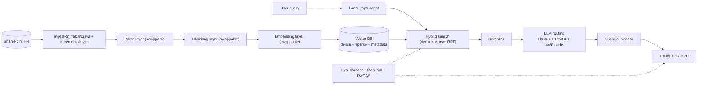

# HC-NS Enterprise Knowledge Base Agent

> **Trợ lý hỏi-đáp tri thức Hành chính – Nhân sự** · Pipeline team mới (LangGraph) + Evaluation Framework · Đối chứng so sánh với baseline team hiện tại

[](./LICENSE)

## Vision

Xây dựng pipeline **team mới** (LangGraph, cấu hình linh hoạt) cho hệ thống **Knowledge Base nội bộ** domain **Hành chính — Nhân sự (HC-NS)**, kèm **evaluation framework pipeline-agnostic** để **so sánh khách quan** với pipeline **team hiện tại đang triển khai** (baseline) trên cùng bộ golden set và cùng bộ đo.

### Goals

1. **E2E pipeline team mới:** SharePoint ingest → parse → chunk → embed → hybrid search → rerank → route & generate → trả lời + citations.
2. **Swappable components:** Mỗi thành phần (chunking / embedding / retrieval / reranker / LLM) có thể thay thế qua config để chạy ablation.
3. **Evaluation framework:** Đo retrieval, generation, hệ thống trên golden set chung — chạy được cho cả baseline và team mới qua adapter pattern.
4. **Bảng so sánh số liệu:** Baseline vs team mới với delta rõ ràng (Recall@k, Context Precision, Faithfulness, Correctness, Cost, Latency…).
5. **Repo chuẩn hóa:** 3 source (frontend/backend/agents) + `eval/` + `docs/` + `.skills/` + `AGENTS.md`.

### Non-goals (phase này)

- Không xử lý PII (không có personal data → bỏ hoàn toàn).
- Không tự xây guardrail (giữ dịch vụ vendor — đang confirm).
- Không thay đổi hệ thống team hiện tại.

## Two Pipelines

### Pipeline team hiện tại (baseline)

```
SharePoint → Auto-sync → Parse (LlamaParse/VLM) → Parent-Child chunking
→ Embedding (Gemini 3072d) → Vector DB → Dense retrieval (top-k=5)
→ LLM (Gemini 3 Flash) → Guardrail (vendor) → Trả lời
                                      ↑
                              Eval: DeepEval
```

| Thành phần | Team hiện tại (baseline) |
|-----------|-------------------------|
| Orchestration | Pipeline tĩnh |
| Chunking | Parent-Child |
| Embedding | Gemini large 3072 |
| Retrieval | Dense-only, top-k=5 |
| Reranker | ❌ Không có |
| LLM | Gemini 3 Flash (single) |
| Eval | DeepEval |

### Pipeline team mới (LangGraph, cấu hình linh hoạt)

```
SharePoint → Ingest (fetch/crawl + incremental sync)
→ Parse (swappable: LlamaParse / VLM / docling)
→ Chunking (swappable: parent-child + contextual headers)
→ Embedding (swappable: Gemini / voyage / BGE-M3)
→ Vector DB (dense + sparse + metadata)
→ LangGraph agent → Hybrid search (dense+sparse, RRF)
→ Reranker (Cohere v3.5 / bge-reranker)
→ LLM routing (Flash ↔ Pro/GPT-4o/Claude)
→ Guardrail (vendor) → Trả lời + citations
                                      ↑
                          Eval: DeepEval + RAGAS
```

| Thành phần | Team mới (đề xuất) |
|-----------|-------------------|
| Orchestration | **LangGraph agent** |
| Parse | Swappable: LlamaParse / VLM / docling |
| Chunking | Parent-Child + contextual headers + structure-aware |
| Embedding | Benchmark đa model: Gemini / voyage / **BGE-M3** |
| Retrieval | **Hybrid** dense+sparse (RRF), tune alpha |
| Reranker | ✅ Cross-encoder (Cohere v3.5 / bge-reranker) |
| LLM | **Routing 2 tầng**: Flash ↔ model mạnh |
| Eval | **DeepEval + RAGAS**, regression gate |

> **Nền tảng điều phối:** Ưu tiên **Pipecon Nexus** (đang xin early access). Nếu chưa có → fallback baseline tự host.

## Architecture



### LangGraph Agent Nodes

1. **Query classifier** — factual / procedural / multi-hop / comparative / out-of-scope
2. **Retrieve** — hybrid search (dense + sparse, RRF)
3. **Rerank** — cross-encoder, N=20–30 → keep k=3–8; score threshold → no-context → "liên hệ HR"
4. **Route & Generate** — route theo độ khó, ép citation, temp 0.1
5. **(Tùy chọn) Self-correct / fallback** — faithfulness thấp → escalate model mạnh hoặc re-retrieve

## Target Metrics

| Tầng | Metric | Target khởi điểm |
|------|--------|-----------------|
| Retrieval | Recall@5 / Context Precision / MRR / NDCG@5 | ≥0.90 / ≥0.75 / ≥0.75 / ≥0.80 |
| Generation | Faithfulness / Answer Relevancy / Correctness | ≥0.90 / ≥0.85 / ≥0.80 |
| Generation | Hallucination rate | < 5% |
| System | Latency P95 / Cost per query | ≤ baseline / theo dõi |

## Tech Stack

| Layer | Technology |
|-------|-----------|
| Frontend | Next.js 16, TypeScript, Tailwind CSS 4, App Router |
| Backend | Python (ingestion, parsing, chunking, embedding, retrieval, API) |
| Agents | **LangGraph** (state graph), swappable components |
| Embedding | Gemini / voyage / **BGE-M3** (benchmark) |
| LLM | Gemini 3 Flash ↔ Pro / GPT-4o / Claude (routing) |
| Retrieval | Hybrid dense+sparse (RRF), cross-encoder reranker |
| Evaluation | DeepEval + RAGAS, golden set versioned |
| Package manager | Bun (frontend), uv/poetry (Python) |

## Directory Structure

| Directory | Responsibility |
|-----------|---------------|
| `frontend/` | Chat UI — query input, answer display with citations |
| `backend/` | SharePoint ingest, parse, chunk, embed, retrieval, API |
| `agents/` | **LangGraph** state graph: classifier, retrieve, rerank, generate nodes |
| `eval/` | **Independent deliverable:** golden set, harness, adapters, metrics, judges, reports |
| `packages/shared-types/` | Shared type definitions across frontend/backend/agents |
| `docs/human/` | Architecture, setup, ADRs — for developers and operators |
| `docs/ai/` | Context, glossary — optimized for AI agent consumption |
| `.skills/` | Reusable agent skills (1 shared skill + external references) |
| `AGENTS.md` | Shared coding standards for all agents (human & AI) |

> **Why `eval/` is separate:** Evaluation is the core deliverable — not a side effect. It runs on any pipeline (baseline, team mới) via shared adapters, with its own CI gate, versioning, and ownership.

## Milestone Roadmap

| Milestone | Focus | Key Deliverables |
|-----------|-------|-----------------|
| **M001 — Bootstrap** | Repo chuẩn hóa + eval framework skeleton | Directory structure, purpose READMEs, AGENTS.md, eval harness + adapter interface, Next.js frontend |
| **M002 — Ingestion** | SharePoint sync & processing | Fetch/crawl, LlamaParse parsing, parent-child chunking, embedding, vector store |
| **M003 — Retrieval & LangGraph Agent** | Agent pipeline | LangGraph state graph, hybrid search (RRF), reranker, LLM routing, citations, chat UI |
| **M004 — Eval Framework** | Measurement + comparison | Golden set ingestion, DeepEval + RAGAS metrics, adapter chạy chung baseline & team mới, bảng so sánh |
| **M005 — Tuning & Report** | Ablation + regression gate | Sweep tham số, ablation report, config tối ưu, regression gate trong CI |

## Quick Start

```bash
# 1. Clone the repo
git clone <repo-url>
cd <repo-name>

# 2. Frontend — install dependencies and start dev server
cd frontend
bun install
bun dev
# → http://localhost:3000

# 3. Backend — see backend/README.md for Python setup
cd ../backend
# (coming in M002)

# 4. Agents — see agents/README.md for LangGraph setup
cd ../agents
# (coming in M003)

# 5. Evaluation — see eval/README.md
cd ../eval
# (coming in M001/M004)
```

## Open Questions

| # | Question | Owner | Status |
|---|----------|-------|--------|
| 1 | **Guardrail:** team mình tự làm hay giữ hoàn toàn vendor? | TBD | 🟡 Pending |
| 2 | **Golden set:** ai sở hữu nội dung & nghiệm thu đáp án chuẩn HC-NS? Khi nào có? | TBD | 🟡 Pending |
| 3 | **Pipecon Nexus:** timeline early access? Tiêu chí quyết định fallback? | TBD | 🟡 Pending |
| 4 | **Vector DB:** chốt Pinecone (sparse-native) hay Qdrant/khác? | TBD | 🟡 Pending |
| 5 | Acceptable metric thresholds cho domain HC-NS? | TBD | 🟡 Pending |
| 6 | SharePoint permission enforcement level trong baseline phase? | TBD | 🟡 Pending |

## Success Metrics

- Retrieval và generation metrics đạt target trên golden set.
- Pipeline team mới chạy E2E ổn định, reproducible.
- Bảng so sánh số liệu baseline vs team mới với delta rõ ràng.
- Repo adopted as team standard, eval chạy CI gate mỗi PR.

## Skills Strategy

| Skill | Source | Dùng cho |
|-------|--------|---------|
| `building-kb-consistently` | **Tự viết** — duy nhất | Convention chung: cấu trúc repo, AGENTS.md, coding standard, swappable component pattern, eval workflow |
| LangChain Skills | `langchain-ai/langchain-skills` | LangGraph agent patterns, dependency management |
| rag-implementation | External (Smithery) | RAG với vector DB + semantic search |
| Hybrid search + reranking | External | Dense+sparse (RRF), cross-encoder rerank |
| RAG evaluation | External | DeepEval + RAGAS, golden set, regression gate |

---

*Project này xây pipeline team mới (LangGraph) để so sánh khách quan với baseline team hiện tại, trên cùng golden set và cùng bộ đo. Evaluation framework là deliverable cốt lõi.*
