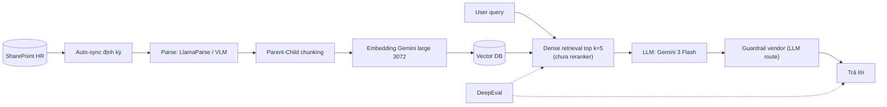
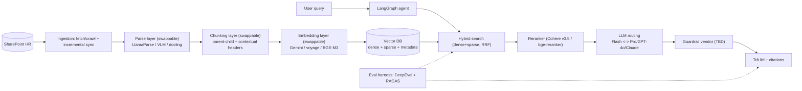

# PRD — KB Enterprise HC-NS (Pipeline so sánh)

<aside>
📄

**PRD — Hệ thống KB Enterprise cho Hành chính Nhân sự** · Trạng thái: **Draft v1.0** — đang review

Mục đích: định nghĩa pipeline **team mới** (LangGraph) và **evaluation framework** để **so sánh khách quan** với pipeline **team hiện tại đang triển khai**.

</aside>

**Thông tin phiên bản tài liệu**

| Phiên bản | Cập nhật | Tác giả | Trạng thái |
| --- | --- | --- | --- |
| v1.0 | 29/05/2026 | Thành | Draft — đang review |

## 1. Bối cảnh & mục tiêu

<aside>
🎯

**Bài toán:** Xây dựng một ứng dụng agent **end-to-end** cho hệ thống **Knowledge Base nội bộ** doanh nghiệp, **domain Hành chính — Nhân sự (HC-NS)**, kèm **evaluation framework** cho agents.

**Mục đích cốt lõi:** Pipeline của **team mình (team mới)** được dựng để **đối chứng / so sánh** với pipeline mà **team hiện tại đang triển khai**, trên cùng một bộ dữ liệu và cùng một bộ đo.

</aside>

**Phân định rõ 2 team (quan trọng — đọc kỹ):**

| Vai trò | Mô tả |
| --- | --- |
| **Team hiện tại** (đang triển khai) | Đã có pipeline RAG đang chạy thật → đây là **baseline** để đối chứng. KHÔNG phải pipeline của team mình, cũng không phải hướng team mình nhắm tới. |
| **Team mới** (team mình) | Xây một pipeline **mới, cấu hình linh hoạt** để so sánh với team hiện tại. Có thể swap chunking / embedding / eval… để dễ benchmark cùng điều kiện. Agents dùng **LangGraph**. |

## 2. Mục tiêu & tiêu chí thành công

1. Dựng pipeline E2E (ingestion → retrieval → generation) cho HC-NS, **chạy được trên cùng golden set** với team hiện tại.
2. Mỗi thành phần (parse/chunking/embedding/retrieval/reranker/LLM/eval) là **module có thể thay thế (swappable)** để chạy ablation và so sánh.
3. **Evaluation framework** tách riêng, **pipeline-agnostic**, đo được cả 2 pipeline qua một lớp adapter chung.
4. Có **bảng so sánh số liệu** baseline vs team mới với delta rõ ràng (Recall@k, Context Precision, Faithfulness, Correctness, Cost, Latency…).
5. Repo chuẩn hóa: 3 source (frontend/backend/agents) chung repo + `eval/` + `docs/` (human & AI) + `.skills/` + `AGENTS.md`.

## 3. Phạm vi

| Trong scope | Ngoài scope |
| --- | --- |
| Pipeline team mới (LangGraph), các thành phần swappable, evaluation framework, repo chuẩn + skills, bảng so sánh 2 team | **Xử lý PII** (không có personal data → bỏ hoàn toàn), **tự xây guardrail** (giữ dịch vụ vendor), thay đổi hệ thống team hiện tại |

<aside>
🗂️

Nguồn dữ liệu là **SharePoint của HR (source of truth)**; team chỉ fetch để index embeddings, **không lưu raw data** → không vướng data residency, dùng cloud thoải mái (Pinecone / OpenAI / Cohere…). Tham chiếu chi tiết chiến lược tối ưu từng thành phần ở tài liệu *“Chiến lược Optimize Hệ thống Team Cũ (Component-by-Component)”*.

</aside>

## 4. Hai pipeline

### 4.1. Pipeline team hiện tại (baseline)



- Eval của team hiện tại: **DeepEval**.
- Đặc điểm: pipeline tĩnh, dense-only, **chưa có reranker**, single LLM.

### 4.2. Pipeline team mới (cấu hình linh hoạt)



<aside>
🧭

**Nền tảng điều phối:** **ưu tiên Pipecon Nexus** (đang xin early access). Nếu chưa có quyền truy cập → **fallback** về cách dựng baseline tự host. PRD này hiện viết cho cả 2 đường, lõi nghiệp vụ giữ nguyên (adapter interface không đổi).

</aside>

## 5. Bảng so sánh: Team hiện tại (baseline) vs Team mới

| Thành phần | Team hiện tại (baseline) | Team mới (đề xuất) |
| --- | --- | --- |
| Orchestration | Pipeline tĩnh | **LangGraph agent**  • Pipecon Nexus (ưu tiên) / fallback baseline |
| Ingestion | Auto-sync SharePoint | Fetch/crawl + incremental sync + metadata (`last_updated`, `category`) |
| Parse | LlamaParse / VLM | Swappable: LlamaParse (ưu tiên) / VLM / docling / unstructured.io |
| Chunking | Parent-Child | Parent-Child + contextual headers + structure-aware (swappable) |
| Embedding | Gemini large 3072 | Benchmark đa model: Gemini / voyage / **BGE-M3** (swappable) |
| Retrieval | Dense-only, top k=5 | **Hybrid** dense+sparse (RRF), tune alpha |
| Reranker | ❌ Không có | ✅ Cross-encoder (Cohere Rerank v3.5 / bge-reranker-v2-m3) |
| LLM | Gemini 3 Flash (single) | **Routing 2 tầng**: Flash ↔ Pro / GPT-4o / Claude |
| Guardrail | Vendor (LLM route) | Vendor (giữ nguyên — cần confirm team có làm hay không) |
| Evaluation | **DeepEval** | **DeepEval + RAGAS**, golden set versioned, regression gate |
| Agents framework | — | **LangGraph** |

<aside>
📊

Khung số liệu so sánh (điền sau khi có golden set & chạy benchmark):

**Retrieval:** Recall@5 · Context Precision · MRR · NDCG@5 — **Generation:** Faithfulness · Answer Relevancy · Correctness · Hallucination rate — **System:** Latency P95 · Cost/query. Mỗi dòng ghi: *Baseline | Team mới | Δ*.

</aside>

## 6. Kiến trúc agents (LangGraph)

Agent là một **state graph** với các node tách bạch, dễ test và observe:

1. **Query classifier** — phân loại factual / procedural / multi-hop / comparative / out-of-scope.
2. **Retrieve** — gọi hybrid search (dense + sparse, RRF).
3. **Rerank** — cross-encoder, retrieve N=20–30 → keep k=3–8; có **score threshold** → no-context thì trả “liên hệ HR”.
4. **Route & Generate** — route theo độ khó (Flash ↔ model mạnh), ép citation, temp 0.1.
5. **(Tùy chọn) Self-correct / fallback** — nếu faithfulness/confidence thấp → escalate model mạnh hoặc re-retrieve.

<aside>
🧩

Mỗi node expose cùng **interface chuẩn** (`ingest` / `retrieve` / `generate`) để `eval/` gọi chung cho cả baseline lẫn team mới qua lớp adapter. State graph giúp visualize flow, isolate behavior, thêm loopback/fallback dễ dàng.

</aside>

## 7. Các thành phần linh hoạt (swappable) để so sánh

Dựa trên chiến lược optimize từng thành phần (file MD tham chiếu). Tất cả đều bật/tắt qua config để chạy ablation:

- **Chunking:** parent-child + contextual headers + structure-aware (cắt theo Điều/Khoản/heading), giữ bảng nguyên khối. Sweep child 256–512, overlap 10–20%, parent 1024–2048.
- **Embedding:** benchmark OpenAI 3-large / voyage-3-large / **BGE-M3** / e5-large / Vietnamese-bi-encoder trên labeled set; tối ưu dimension (Matryoshka). Chỉ đổi khi thắng rõ (vì phải re-index).
- **Hybrid search:** dense + BM25/SPLADE, word segmentation tiếng Việt (underthesea/VnCoreNLP), fusion RRF / weighted alpha (sweep 0.3–0.8).
- **Reranker:** Cohere Rerank v3.5 (managed) hoặc bge-reranker-v2-m3 (self-host). Tune N→k, threshold.
- **LLM routing:** classifier → Flash cho câu dễ, model mạnh cho multi-hop/comparative; cascade fallback; cost guard.
- **Eval:** DeepEval + RAGAS, tách Retrieval/Generation, tracing (Langfuse/LangSmith), regression gate.

## 8. Evaluation framework (deliverable lõi)

<aside>
🧪

Eval là **trọng tâm của task này** và là **deliverable độc lập**, đặt ở thư mục `eval/` riêng (xem mục 9). Lý do tách riêng: (1) là sản phẩm cốt lõi để so sánh 2 team; (2) **pipeline-agnostic** — chạy chung cho baseline & team mới qua adapter; (3) vòng đời & ownership riêng; (4) có CI gate riêng.

</aside>

- **Golden dataset / raw data:** sẽ được **cung cấp sau** → thiết kế harness trước, cắm dữ liệu sau. Bố cục theo loại câu (factual / procedural / multi-hop / comparative / edge / out-of-scope), versioned (JSON), HR validate đáp án chuẩn.
- **Adapter pattern:** `baseline_adapter` và `newteam_adapter` cùng implement một interface → harness chạy **cùng golden set** cho cả hai, xuất bảng delta.
- **Hai tầng metric:**

| Tầng | Metric | Target khởi điểm |
| --- | --- | --- |
| Retrieval | Recall@5 / Context Precision / MRR / NDCG@5 | ≥0.90 / ≥0.75 / ≥0.75 / ≥0.80 |
| Generation | Faithfulness / Answer Relevancy / Correctness | ≥0.90 / ≥0.85 / ≥0.80 |
| Generation | Hallucination rate | &lt; 5% |
| System | Latency P95 / Cost per query | ≤ baseline / theo dõi |
- **RAG triad** (context relevance, groundedness, answer relevance) + **regression gate** trong CI mỗi khi đổi component.

## 9. Cấu trúc thư mục tham khảo (monorepo)

```
hr-kb-platform/
├── AGENTS.md                      # quy chuẩn chung cho toàn repo
├── README.md
├── docker-compose.yml
├── .github/
│   └── workflows/
│       └── eval-regression.yml    # CI: chạy eval gate mỗi PR đổi pipeline
├── .skills/
│   └── building-kb-consistently/  # SKILL CHUNG DUY NHẤT (tự viết & maintain)
│       ├── SKILL.md
│       ├── references/
│       └── scripts/
├── docs/
│   ├── human/
│   │   ├── architecture.md
│   │   ├── setup.md
│   │   └── decisions/             # ADRs
│   └── ai/
│       ├── context.md
│       └── glossary.md
├── frontend/
│   ├── AGENTS.md
├── backend/
│   ├── AGENTS.md
│   ├── src/
│   │   ├── ingestion/             # SharePoint fetch/crawl + sync
│   │   ├── parsing/               # swappable: llamaparse / vlm / docling
│   │   ├── chunking/              # swappable strategies
│   │   ├── embedding/             # swappable models
│   │   ├── retrieval/             # hybrid + rerank
│   │   └── api/
│   └── pyproject.toml
├── agents/
│   ├── AGENTS.md
│   ├── src/
│   │   ├── graph/                 # LangGraph state graph
│   │   ├── nodes/                 # classifier, retrieve, rerank, generate
│   │   ├── prompts/
│   │   └── tools/
│   └── pyproject.toml
├── eval/                          # DELIVERABLE LÕI — pipeline-agnostic
│   ├── AGENTS.md
│   ├── README.md
│   ├── datasets/
│   │   ├── golden/                # golden set versioned (cung cấp sau)
│   │   └── raw/                   # raw data (cung cấp sau)
│   ├── adapters/                  # baseline_adapter, newteam_adapter
│   ├── harness/                   # runner chạy cùng golden set
│   ├── metrics/                   # retrieval + generation metrics
│   ├── judges/                    # LLM-as-judge configs
│   └── reports/                   # benchmark + ablation outputs
└── packages/
    └── shared-types/              # type/interface dùng chung
```

## 10. Skills cho `.skills/`

<aside>
🧠

**Nguyên tắc:** chỉ tự viết & maintain **MỘT skill chung** = `building-kb-consistently` (cách triển khai đồng nhất trên toàn repo). Các năng lực theo tech stack thì **tái sử dụng skill có sẵn** (chuẩn mở Agent Skills — folder + `SKILL.md` + `scripts/`/`references/`, đặt tên dạng gerund, progressive disclosure), không viết lại từ đầu.

</aside>

### 10.1. Skill chung duy nhất (tự viết)

| Skill | Nội dung |
| --- | --- |
| `building-kb-consistently` | Convention chung: cấu trúc repo & [AGENTS.md](http://AGENTS.md) lồng nhau, coding standard cho frontend/backend/agents, cách thêm một component **swappable** theo adapter interface, cách viết & chạy eval, quy ước commit/PR, cách dùng các skill ngoài. |

### 10.2. Skills đề xuất theo tech stack (tái sử dụng, không tự viết)

| Skill / Nguồn | Dùng cho |
| --- | --- |
| **LangChain Skills** (`langchain-ai/langchain-skills`): `framework-selection`, `langchain-dependencies`, build agent với LangGraph/Deep Agents | Chuẩn hóa cách dựng LangGraph agent, chọn pattern, quản version dependency |
| **rag-implementation** (wshobson / Smithery) | Khung dựng RAG với vector DB + semantic search |
| Skill hybrid search + reranking | Triển khai dense+sparse (RRF) và cross-encoder rerank đúng chuẩn |
| Skill embedding model evaluation | Benchmark đa model embedding trên labeled set, tối ưu dimension |
| Skill RAG evaluation (DeepEval / RAGAS) | Dựng golden set, RAG triad, regression gate cho `eval/` |

**Nguồn tham khảo:**

- [Agent Skills —](https://agentskills.io/) [agentskills.io](http://agentskills.io) · [Specification](https://agentskills.io/specification)
- [LangChain Skills (GitHub)](https://github.com/langchain-ai/langchain-skills) · [Deep Agents — Skills](https://docs.langchain.com/oss/python/deepagents/skills)
- [Build a custom RAG agent với LangGraph](https://docs.langchain.com/oss/python/langgraph/agentic-rag)
- [rag-implementation skill (Smithery)](https://smithery.ai/skills/wshobson/rag-implementation)
- [Pinecone — Rerank results](https://docs.pinecone.io/guides/search/rerank-results) · [AGENTS.md](http://AGENTS.md) [format](https://agents.md/)

## 11. Guardrail (cần confirm)

- Guardrail (LLM route) **do bên khác cung cấp** (vendor). Team mình **có thể làm hoặc không** — **chưa chốt**, confirm sau.
- Trước mắt: giữ nguyên vendor, chỉ cấu hình **ngưỡng no-context** ở tầng retrieval/rerank trước khi gọi LLM.

## 12. Dữ liệu & golden dataset

- Source of truth: **SharePoint HR**; chỉ fetch để index, không lưu raw.
- **Golden dataset / raw data: cung cấp sau** → harness & adapter thiết kế trước, cắm dữ liệu khi có.
- Cần chốt: ai sở hữu nội dung & nghiệm thu đáp án chuẩn HC-NS.

## 13. Roadmap (ordered experiments)

| Bước | Hành động | Deliverable |
| --- | --- | --- |
| 0. Khung | Dựng repo chuẩn + `eval/` harness + adapter (baseline & team mới) | Repo skeleton + eval chạy được khi có data |
| 1. Baseline | Cắm golden set, đo baseline (DeepEval + RAGAS) | Bộ số baseline + golden set versioned |
| 2. Hybrid + Reranker (P0) | Bật sparse + fusion + cross-encoder | Delta retrieval/precision vs baseline |
| 3. Chunking + Embedding (P1) | Contextual headers + benchmark model | Delta context recall + bảng so sánh model |
| 4. LLM Routing (P1) | Classifier + route + citation | Delta correctness theo query_type |
| 5. Tuning + Report | Sweep tham số + ablation + regression gate | Benchmark report cuối + config tối ưu |

## 14. Rủi ro & lưu ý

| Rủi ro | Giảm thiểu |
| --- | --- |
| Golden set/raw data cung cấp trễ → block benchmark | Thiết kế harness + adapter trước; dùng tập mẫu nhỏ để smoke-test |
| Pipecon Nexus chưa được early access | Fallback baseline tự host; giữ adapter interface bất biến |
| Reranker đôi khi làm tụt recall | A/B có/không rerank trên golden set, giữ theo số đo |
| Đổi embedding phải re-index toàn bộ | Chỉ đổi khi thắng rõ; re-index off-peak |
| Tokenization tiếng Việt ảnh hưởng BM25 | underthesea/VnCoreNLP; đo nhánh sparse riêng |
| Guardrail chưa chốt scope | Confirm sớm; tạm giữ vendor + ngưỡng no-context |

## 15. Câu hỏi mở

1. **Guardrail:** team mình có tự làm không, hay giữ hoàn toàn vendor?
2. **Golden set:** ai sở hữu nội dung & nghiệm thu đáp án chuẩn HC-NS, khi nào có?
3. **Pipecon Nexus:** timeline early access? Tiêu chí quyết định fallback?
4. **Vector DB:** chốt Pinecone (sparse-native) hay Qdrant/khác?

## 16. Changelog

| Phiên bản | Ngày | Thay đổi |
| --- | --- | --- |
| v0.1 | 29/05/2026 | Bản draft đầu tiên (PRD baseline). |
| v0.2 | 29/05/2026 | Thêm: baseline dùng DeepEval; golden/raw data cung cấp sau; tách `eval/`. |
| v0.3 | 29/05/2026 | Thêm version + changelog; mở rộng cây thư mục; mục skills tham khảo. |
| v1.0 | 29/05/2026 | **Viết lại toàn bộ**: định khung lại 2 team (baseline = team hiện tại; team mới xây pipeline so sánh); pipeline linh hoạt theo file optimize; agents **LangGraph**; bảng so sánh 2 team; skills = 1 skill chung + đề xuất theo tech stack. |