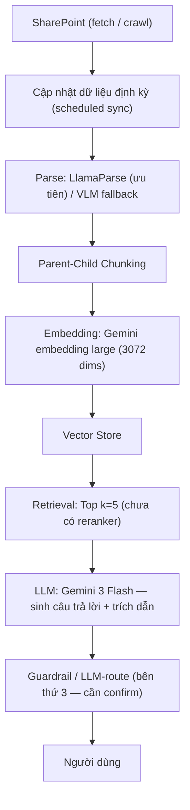

# PRD — Hệ thống KB Enterprise cho Hành chính Nhân sự (Baseline)

<aside>
🎯

**Mục tiêu tài liệu:** Định nghĩa yêu cầu cho phiên bản **baseline** của một ứng dụng agent E2E phục vụ tra cứu tri thức (Knowledge Base) trong lĩnh vực **Hành chính – Nhân sự (HC-NS)**, kèm **evaluation framework** cho agents. Bản baseline dùng để **so sánh đối chứng (benchmark)** với pipeline mà team hiện tại đang triển khai, đồng thời chuẩn bị đường nâng cấp lên **Pipecon Nexus** khi được cấp early access.

</aside>

<aside>
⚠️

**Trạng thái:** Draft v0.1 · Cần review. Một số quyết định còn để mở (xem mục *Câu hỏi mở*): phạm vi guardrail, thời điểm có Pipecon Nexus, và việc bổ sung reranker.

</aside>

## 1. Bối cảnh & Vấn đề

- Doanh nghiệp cần một trợ lý hỏi-đáp dựa trên kho tài liệu nội bộ HC-NS (quy chế, chính sách, quy trình, biểu mẫu, FAQ nhân sự).
- Tài liệu phân tán trên **SharePoint**, cập nhật định kỳ, định dạng đa dạng (văn bản, bảng, file scan/ảnh).
- Cần một **agent E2E** truy xuất chính xác, trả lời có dẫn nguồn, kiểm soát được rủi ro (guardrail), và **đo lường được chất lượng** một cách hệ thống.
- Đã có một team nội bộ triển khai pipeline riêng → cần **baseline chuẩn hóa** để so sánh khách quan.

## 2. Mục tiêu & Phi mục tiêu

### Mục tiêu (Goals)

1. Xây dựng pipeline RAG/agent **baseline** chạy E2E từ ingest → trả lời.
2. Xây dựng **evaluation framework** đo được retrieval, generation, agent behavior và guardrail.
3. Cho phép **so sánh định lượng** baseline vs. pipeline của team hiện tại trên cùng bộ test.
4. Thiết lập **repo mẫu chuẩn** (monorepo) với chuẩn code, docs cho người & AI, và `.skills`/`AGENTS.md`.
5. Thiết kế kiến trúc **module hóa** để dễ thay thế từng thành phần (parser, embedding, reranker, LLM) và nâng cấp lên Pipecon Nexus.

### Phi mục tiêu (Non-goals)

- Không xây dựng guardrail riêng trong phase baseline (do bên thứ ba cung cấp — *cần confirm*).
- Không tối ưu hạ tầng production-scale ở phase đầu (ưu tiên đo lường & đối chứng).
- Không tự huấn luyện model embedding/LLM.

## 3. Phạm vi (Scope)

| **Trong phạm vi** | **Ngoài phạm vi (phase này)** |
| --- | --- |
| Ingest từ SharePoint, parse, chunking, embedding, retrieval, sinh câu trả lời | Tự phát triển guardrail/LLM-route |
| Agent hỏi-đáp HC-NS có dẫn nguồn | Tích hợp Pipecon Nexus (chờ early access) |
| Evaluation framework + bộ test đối chứng | Multi-tenant, phân quyền chi tiết theo phòng ban (giai đoạn sau) |
| Repo mẫu (FE/BE/agents + docs + .skills) | Mobile app |

## 4. Người dùng & Use cases

- **Nhân viên:** tra cứu chính sách nghỉ phép, bảo hiểm, lương thưởng, quy trình onboarding/offboarding.
- **Cán bộ HC-NS:** tra cứu nhanh quy chế, biểu mẫu, hướng dẫn xử lý tình huống.
- **Quản lý/Lãnh đạo:** câu hỏi tổng hợp về quy định, tổng quan chính sách.

**Use case mẫu:**

- [ ]  "Quy định nghỉ phép năm hiện tại là bao nhiêu ngày?"
- [ ]  "Quy trình xin nghỉ thai sản gồm những bước nào, cần biểu mẫu gì?"
- [ ]  "Chính sách công tác phí mới nhất khác gì bản cũ?"
- [ ]  "Tải mẫu đơn xác nhận nhân sự ở đâu?"

## 5. Kiến trúc & Pipeline Baseline



### Chi tiết từng thành phần

| **Bước** | **Lựa chọn baseline** | **Ghi chú / điểm có thể thay thế** |
| --- | --- | --- |
| Nguồn dữ liệu | SharePoint (fetch/crawl) | Cần cơ chế auth + phân quyền đọc |
| Đồng bộ | Cập nhật định kỳ (cron/scheduled) | Cần xử lý incremental update & xóa tài liệu cũ |
| Parse | LlamaParse (ưu tiên), VLM fallback | VLM cho file scan/ảnh/bảng phức tạp |
| Chunking | Parent-child chunking | Tune kích thước parent/child theo eval |
| Embedding | Gemini embedding large, 3072 dims | Cố định để đối chứng công bằng |
| Retrieval | Top k = 5 | **Chưa dùng reranker** — đề xuất A/B thêm reranker |
| Generation | Gemini 3 Flash | Bắt buộc trả lời kèm trích dẫn nguồn |
| Guardrail | LLM-route (bên thứ 3) | Team có thể tự làm hoặc không — **confirm sau** |

## 6. Đường nâng cấp: Pipecon Nexus vs. Baseline

<aside>
🔀

**Chiến lược 2 nhánh:** Ưu tiên **Pipecon Nexus** (đang xin early access). Nếu chưa có quyền truy cập, dùng **baseline** mô tả ở trên làm phương án dự phòng. Kiến trúc module hóa để khi có Nexus chỉ cần thay lớp pipeline mà không ảnh hưởng FE/agents/eval.

</aside>

- Định nghĩa **interface trừu tượng** cho pipeline (ingest/retrieve/generate) → cho phép hoán đổi baseline ↔ Nexus.
- Cùng một **evaluation harness** chạy được trên cả hai để so sánh trực tiếp.

## 7. Yêu cầu chức năng (Functional)

1. **Ingestion:** kết nối SharePoint, fetch/crawl, đồng bộ định kỳ, theo dõi phiên bản tài liệu.
2. **Processing:** parse (LlamaParse/VLM), parent-child chunking, embedding 3072d, lưu vector store + metadata (nguồn, ngày cập nhật, phòng ban).
3. **Retrieval & Answering:** truy vấn top-k, sinh câu trả lời có **trích dẫn nguồn** và link tới tài liệu gốc.
4. **Agent:** hội thoại đa lượt, giữ ngữ cảnh, biết nói "không tìm thấy" khi thiếu dữ liệu.
5. **Guardrail (tùy chọn):** lọc nội dung nhạy cảm/ngoài phạm vi, định tuyến qua LLM-route.
6. **Observability:** log truy vấn, chunk được lấy, độ trễ, chi phí token.

## 8. Yêu cầu phi chức năng (Non-functional)

- **Độ chính xác:** ưu tiên hàng đầu (domain HC-NS nhạy cảm, cần đúng quy định).
- **Độ trễ:** mục tiêu p95 < 5s cho phản hồi (cần chốt).
- **Bảo mật:** tôn trọng phân quyền tài liệu SharePoint, không rò rỉ dữ liệu ngoài phạm vi người dùng.
- **Khả năng quan sát & tái lập:** mọi eval phải reproducible (seed, version dữ liệu, version model).
- **Module hóa:** thay thế từng thành phần không phá vỡ hệ thống.

## 9. Evaluation Framework cho Agents

<aside>
📊

Mục tiêu: đo lường khách quan, **so sánh được** baseline vs. team hiện tại vs. Pipecon Nexus trên cùng bộ test & cùng metric.

</aside>

### 9.1. Các tầng đánh giá

| **Tầng** | **Đo cái gì** | **Metric đề xuất** |
| --- | --- | --- |
| Retrieval | Chất lượng chunk lấy về | Recall@k, Precision@k, MRR, nDCG, Context Relevance |
| Generation | Chất lượng câu trả lời | Faithfulness/Groundedness, Answer Relevance, Correctness, Citation accuracy |
| Agent behavior | Hành vi hội thoại | Task success rate, Tỷ lệ từ chối đúng lúc, Hallucination rate, Multi-turn coherence |
| Guardrail | An toàn & định tuyến | Tỷ lệ chặn đúng, False positive/negative, Leakage rate |
| Vận hành | Hiệu năng & chi phí | Latency p50/p95, Cost/query, Token usage |

### 9.2. Bộ dữ liệu test (Golden set)

<aside>
📥

**Team tôi:** golden dataset / raw data sẽ được **cung cấp sau**. Trong lúc chờ, định nghĩa trước cấu trúc golden set (schema câu hỏi/đáp án/nguồn) và pipeline nạp dữ liệu để sẵn sàng chạy eval ngay khi nhận được data.

</aside>

- Xây **golden Q&A** cho HC-NS: câu hỏi + đáp án chuẩn + tài liệu nguồn kỳ vọng.
- Bao phủ: câu hỏi factual, câu hỏi quy trình nhiều bước, câu hỏi so sánh phiên bản, câu hỏi **không có đáp án** (kiểm tra từ chối/hallucination).
- Gắn nhãn theo độ khó & chủ đề (nghỉ phép, bảo hiểm, lương, onboarding...).

### 9.3. Phương pháp chấm điểm

- **LLM-as-a-judge** cho faithfulness/relevance (kèm rubric rõ ràng).
- **Đối chiếu tự động** với ground truth cho retrieval (so URL/chunk nguồn).
- **Human review** trên mẫu để hiệu chỉnh và kiểm tra độ tin cậy của judge.

### 9.4. Quy trình so sánh đối chứng

<aside>
⚖️

**Công cụ eval của hai bên:**

- **Baseline team hiện tại:** dùng **DeepEval** để đánh giá.
- **Team tôi:** dùng evaluation harness mô tả ở mục 9 (golden set + LLM-as-a-judge + đối chiếu ground truth).

Để so sánh **công bằng**, cần thống nhất cùng golden set, cùng metric và cùng định nghĩa cách chấm; có thể cân nhắc chạy thêm DeepEval trên cùng bộ test để đối chiếu kết quả giữa hai công cụ.

</aside>

1. Cố định golden set + phiên bản dữ liệu.
2. Chạy cùng bộ test qua: Baseline → Pipeline team hiện tại → (sau này) Pipecon Nexus.
3. Xuất **bảng so sánh metric** + báo cáo phân tích định tính các case lỗi.

## 10. Cấu trúc Repo mẫu (Monorepo)

```jsx
repo-root/
├─ AGENTS.md                 # Quy chuẩn chung cho agents/coding (root)
├─ README.md
├─ docs/
│  ├─ human/                 # Tài liệu cho người: kiến trúc, setup, vận hành
│  └─ ai/                    # Tài liệu tối ưu cho AI/agents đọc
├─ .skills/                  # Skills dùng chung cho agents
├─ frontend/                 # Giao diện chat / tra cứu KB
├─ backend/                  # API, ingestion, retrieval, orchestration
├─ agents/                   # Định nghĩa agent, prompt, công cụ (KHÔNG chứa eval)
└─ eval/                     # Evaluation — deliverable độc lập
   ├─ datasets/              # Golden set + raw data (cung cấp sau)
   ├─ harness/               # Runner + adapter cho từng pipeline
   ├─ metrics/               # Định nghĩa metric (retrieval/generation/agent...)
   ├─ judges/                # Rubric + prompt LLM-as-a-judge
   ├─ reports/               # Kết quả + bảng so sánh đối chứng
   └─ README.md
```

| **Thư mục** | **Trách nhiệm** |
| --- | --- |
| `frontend/` | UI hội thoại, hiển thị câu trả lời + trích dẫn nguồn |
| `backend/` | Ingest SharePoint, parse, chunk, embed, retrieve, API |
| `agents/` | Logic agent, prompt, công cụ (không chứa eval) |
| `eval/` | **Deliverable độc lập:** golden set, harness, metrics, judges, reports; chạy được trên **mọi pipeline** (baseline / team hiện tại / Nexus) qua lớp adapter |
| `docs/human/` | Tài liệu cho người phát triển & vận hành |
| `docs/ai/` | Ngữ cảnh & hướng dẫn cho agent/AI |
| `.skills/` | Skill tái sử dụng cho agents |
| `AGENTS.md` | Chuẩn code & quy ước chung để mọi agent code đồng nhất |

<aside>
🧪

**Tại sao tách `eval/` riêng:** Eval là **deliverable cốt lõi** của task (mục tiêu chính là so sánh đối chứng), không phải chức năng phụ của `agents/`.

- **Trung lập với pipeline:** harness phải chạy được trên nhiều hệ (baseline, team hiện tại, Nexus) — nếu nhét trong `agents/` thì bị bó vào một implementation.
- **Vòng đời & quyền sở hữu riêng:** golden set / raw data được cung cấp sau, có owner riêng, version riêng.
- **CI riêng:** chạy eval theo lịch / khi có dữ liệu mới, xuất báo cáo so sánh độc lập.
- **Adapter pattern:** mỗi pipeline expose cùng interface (ingest/retrieve/generate) để `eval/` gọi chung một cách.
</aside>

## 11. Guardrail (cần confirm)

- Hiện do **một bên khác cung cấp** dưới dạng **LLM-route**.
- Team có thể tự làm **hoặc** không → **chưa chốt**.
- Đề xuất: định nghĩa **interface guardrail** để cắm bên ngoài hoặc tự triển khai sau mà không đổi kiến trúc.

## 12. Lộ trình (Milestones — đề xuất)

- [ ]  **M1 — Ingestion & Processing:** SharePoint sync, parse, chunk, embed, vector store.
- [ ]  **M2 — Retrieval & Agent:** top-k retrieval, agent trả lời có trích dẫn, FE cơ bản.
- [ ]  **M3 — Evaluation Framework:** golden set + harness + báo cáo metric.
- [ ]  **M4 — Đối chứng:** so sánh baseline vs. team hiện tại.
- [ ]  **M5 — Mở rộng:** reranker A/B, tích hợp guardrail, sẵn sàng cắm Pipecon Nexus.

## 13. Chỉ số thành công (Success Metrics)

- Retrieval Recall@5 và Faithfulness đạt ngưỡng chốt (TBD) trên golden set.
- Baseline chạy E2E ổn định, reproducible.
- Có **bảng so sánh** rõ ràng giữa baseline và pipeline team hiện tại.
- Repo mẫu được team áp dụng làm chuẩn.

## 14. Câu hỏi mở (Open Questions)

1. **Guardrail:** team tự làm hay dùng bên thứ ba? Phạm vi & SLA?
2. **Pipecon Nexus:** khi nào có early access? Khả năng/giới hạn cụ thể?
3. **Reranker:** có thêm vào baseline để A/B ngay không, hay giữ nguyên top-k=5 để đối chứng "công bằng"?
4. **Ngưỡng metric** chấp nhận được cho HC-NS là bao nhiêu?
5. **Phân quyền tài liệu:** mức độ cần tôn trọng quyền SharePoint ở phase baseline?
6. **Vector store & hạ tầng:** chọn giải pháp nào (cần chốt)?
7. **Golden set:** ai sở hữu nội dung & nghiệm thu đáp án chuẩn HC-NS?